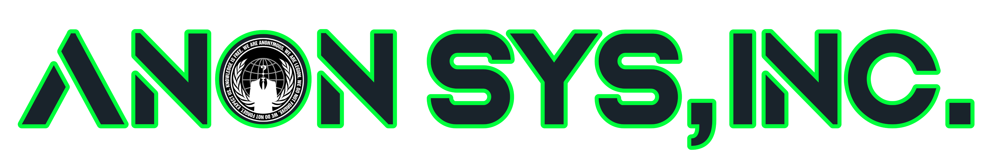

## APT-X4OYP63YCV85E9K (DISTRIBUTED REMOTELY NETWORK API)

    
  <h4 style="color: #31d278;"> -- WE ARE ANON SYS. WE ARE LEGION. -- </h4>
   
  

  THIS PROJECT EXISTS THANKS TO ALL THE PEOPLE WHO CONTRIBUTE.  
  
  

